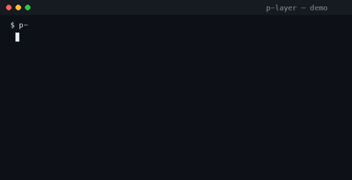

# p-layer

[](https://pypi.org/project/p-layers/)
[](https://pypi.org/project/p-layers/)
[](LICENSE)
[](README.md)

**Memory for AI agents with rules that are kept, not just written.**

🌏 [README.ko.md](README.ko.md) — 한국어

## Demo

<a href="examples/p-layer-demo.mp4"></a>

*The moment that matters: an agent tries to change a P0 rule → the gate **refuses** (human approval required) → approval → applied + audited. Click for the full 26s video.*


AI assistants today are brilliant and forgetful. When a conversation ends, what was decided in it — which payment system you switched to, how a client prefers to be contacted, what actually fixed a bug — ends with it. The next session starts from zero. And when an agent *does* keep notes, there is no control: anyone can write anything, rules are suggestions, and nothing is ever traced.

p-layer gives an agent a memory that works like a well-run organization instead of a junk drawer:

- it **remembers across sessions** and finds what you need even weeks later,
- it is **organized in layers with clear jobs** — from rules that must never change, to incident reports,
- it **enforces its own rules** — the system refuses and records a write that isn't allowed, instead of trusting a prompt,
- it **never destroys** — old versions are superseded, and the full history stays,
- and it **puts everything on the record** — every write, every refused write, is audited.

It is small, has zero dependencies, speaks the standard connector (MCP) that Claude, opencode, and Cursor already use, and runs on your own machine.

---

## The problem this is trying to solve

**Agents are amnesiacs.** A chatbot or coding agent only "remembers" what is in the current window. Ask it next week about the decision it made today and it will guess. The first fix for this is a memory store — a place where facts survive. That part is easy.

**The hard part is control.** Once an agent can write to a long-term memory, three things go wrong:

1. **Anyone can write anything.** A stray thought gets saved as if it were a company rule, and nobody can tell the difference.
2. **Rules are only suggestions.** "Never change the pricing policy" lives in a text file and is *hoped* to be followed, not enforced. The agent that is supposed to obey it is also the one that can edit it.
3. **Everything accumulates, nothing is organized.** Raw session logs pile up forever. Finding "the time we fixed the payment bug" means searching through everything.

p-layer is the answer to those three failures: **rules first, retrieval second.**

---

## The design direction — five principles

### 1. Memory is organized in layers, like a brain or an org chart

Every piece of memory belongs to one of seven layers. Each layer has a job and rules about who may touch it:

| Layer | What lives there | Plain-language purpose | Who may write |
|---|---|---|---|
| **P0** | Rules | The constitution. "Never expose secrets." Must not change. | only the system |
| **P1** | Identity & persona | Who the agent is, how it speaks. | only the system |
| **P2** | Raw sessions | Everything that happened, kept as-is. | system, gateways, cron |
| **P3** | Tool integrations | What the agent can plug into. | system, gateways, cron |
| **P4** | Skills & growth | What the agent has learned to do. | system, agent, human |
| **P5** | Compiled knowledge | Distilled insights — the first place to look. | system, agent, tools |
| **P6** | Incidents & fixes | What broke, why, and what fixed it. | system, agent, human |

Lower layers are higher authority: a P0 rule wins over a P1 preference, without negotiation.

### 2. Rules are enforced by the system, not by asking nicely

When an agent tries to write to a layer it is not allowed to touch, the write is **refused with an error**, and the refusal itself is recorded. The rule is not a suggestion in a text file — it is a permission the system checks on every write.

### 3. Memory is never destroyed — it is superseded

There is no delete button that erases history. "Forgetting" marks an entry as superseded: it stops showing up in searches, but the record of it — and of what replaced it — remains. This is version control applied to memory.

### 4. Everything is on the record

An audit log records every write and every refused write: who did it, to which layer, when, and why. If something wrong ever lands in memory, you can see exactly how it got there — and roll the memory back to a snapshot from before it happened.

### 5. Memory organizes itself

Raw notes are fine for a while; they are not fine forever. p-layer runs maintenance the way a good organization does:

- **Consolidation** — batches of raw session notes are distilled into short insights (the messy P2 becomes useful P5).
- **A compiled wiki** — active knowledge is rendered into clean, per-layer pages with their origin story attached.
- **Snapshots** — you can freeze the memory at a point in time and roll back to it.
- **Re-embedding** — when the underlying understanding model changes, memory is re-indexed in the background instead of breaking.

### One method, two homes

The same memory, with the same rules, runs in two places:

- **SQLite** — a single file on your machine. Perfect for one personal agent.
- **PostgreSQL** — a shared database. For a team or a small business where several agents (or people) use one memory.

The rules, layers, and behavior are identical in both; the same test suite verifies both so they cannot drift apart.

---

## How it works — one story

Suppose your AI assistant is maintaining a small shop's payment system.

1. **P6 — the incident.** The assistant discovers a payment bug. It writes an incident report: what happened, timeline, and its first guess at a root cause.
2. **P0 — the rule check.** The root cause turns out to be a rule violation. The assistant proposes a rule amendment; only the system can actually change P0.
3. **The knowledge graph.** The incident is linked to the payment tool and to the fix pattern it depends on. "What is related to this payment bug?" is now answerable by walking those links — a root-cause analysis.
4. **Weeks later — recall.** A similar symptom appears. The assistant searches memory and the old incident surfaces, ranked by relevance and how certain it was — *before* the same mistake is repeated.
5. **Nightly — consolidation.** The session's raw notes are distilled into a durable insight and added to the compiled knowledge.
6. **The same bug never happens twice** — not because the agent is smarter, but because the organization of its memory remembered.

---

## Proof it works

The eval harness (`p_layer eval <suite.json>`) runs the same data through two engines — the drewgent baseline (a reconstruction of its `searchKnowledge`: quote-stripped OR-join FTS5) and p-layer (hybrid FTS5 + semantic, RRF-fused) — and reports recall@k for both, plus ACL compliance:

```bash
python3 -m p_layer eval examples/suite.example.json
```

Retrieval scores depend on your data and embedder, so this page does not hard-code them; `benchmarks/real_data_bench.py` measures recall@k / MRR on a real memory archive. What is deterministic is the governance: p-layer ranks by **how certain the memory was** and **how fresh it is**, not just by word matching, and all 30 (layer, who) permission cases (every layer × every writer) are enforced by the system (`pass_rate: 1.0`) with every denied write recorded in the audit log.

---

## Try it in two minutes

```bash
pip install p-layers
export P_LAYER_DB=~/.p_layer/memory.db
export P_LAYER_EMBED=hash    # offline mode; ollama is the default

p-layer remember "we switched to PortOne v2 for payments" --type decision
p-layer recall "payment"
p-layer assemble             # the rules + recent memory, ready for context
```

No database to set up, no services to run. The memory is one file.

## Use it with your AI tools

Agents talk to memory through **MCP**, the standard connector. Add one block to your tool's config and the agent can `remember`, `recall`, audit, snapshot, and trace root causes:

```json
{
  "mcp": {
    "p-layer": {
      "type": "local",
      "command": ["python3", "-m", "p_layer", "serve"],
      "env": { "P_LAYER_DB": "~/.p_layer/memory.db" }
    }
  }
}
```

---

## For developers — the technical shape

- **Engine**: `p_layer.store.Store` — SQLite + FTS5 + pluggable embeddings, forward-only checksummed migrations. One schema, one implementation.
- **Governance**: P0-P6 layer ACLs enforced at write time (`WriteDenied`), supersede-not-delete, snapshots/rollback, full audit log, contradiction scan.
- **Recall**: hybrid FTS5 + semantic, RRF fusion, ranked by confidence × freshness, superseded excluded, type-diversified.
- **Graph**: typed entity/relation ontology with constraint validation, explore / trace / root-cause analysis / transitive closure (cycle-safe).
- **Ops jobs**: `reembed` (versioned vector backfill), `consolidate` (episodic → semantic digests), `compile-wiki` (P5 pages). SQLite-only; on PostgreSQL they raise loudly rather than silently degrade.
- **Governance & drift (0.7.0)**: `gate` (P0 ontology review gate — propose → approve → apply/deprecate, human approval required, idempotent, JSONL validation) and `drift-report` (weekly baseline comparison over knowledge/episodes/entities/gate state; read-only, distinguishes no-change from failure).
- **PostgreSQL**: `p_layer.pgstore.PgStore` — same interface and behavior, verified by a shared parity suite (pg_trgm ILIKE for CJK, pgvector optional).
- **MCP server**: 13 tools, zero-dependency stdio implementation, verified end-to-end by wire-level tests (and against the official SDK in CI).
- **Migration from legacy agent memory**: already running an agent memory store? `import-drewgent` copies a legacy `knowledge.db` (knowledge/entities/relations/sessions) into p_layer, and `p_layer.drewdb` can even *open it in place* under p_layer's governance (WAL, busy timeout) so your existing tools keep working while p_layer takes over the connection. `import-rules` / `import-incidents` bring your existing rule and incident files in. You migrate when you're ready — nothing is locked in.
- **Tests**: 156 — SQLite + PostgreSQL parity, governance, graph, ops, MCP wire, packaging.
- PyPI: **`p-layers`** · GitHub: **`p-layer`** · package: **`p_layer`** · console: **`p-layer`**

```bash
python3 -m unittest discover -s tests -v   # no dependencies, no network
```

## Credits

Built as a production-grade rebuild of the P0-P6 vault concept from [opencode-drewgent](https://github.com/humanerd-drew/opencode-drewgent), with orchestration conventions from [Gajae-Code](https://github.com/Yeachan-Heo/gajae-code).

## License

MIT
